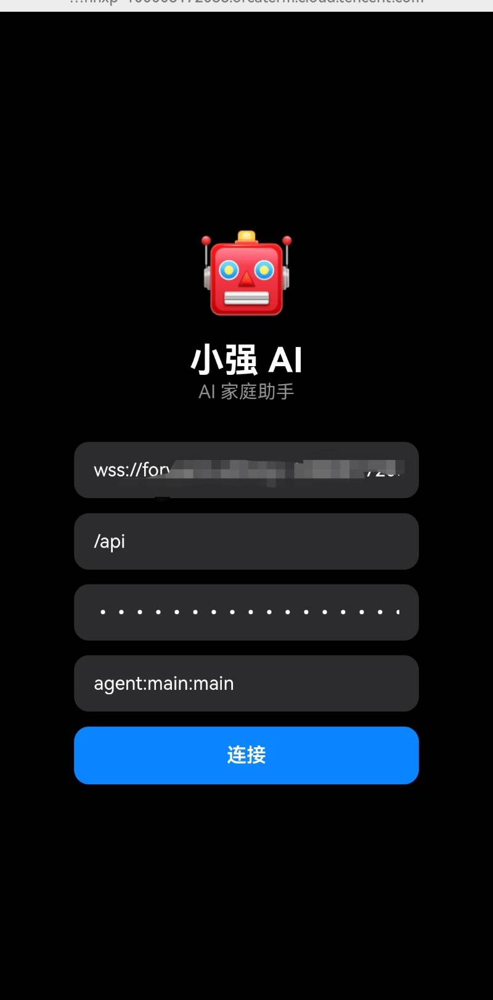
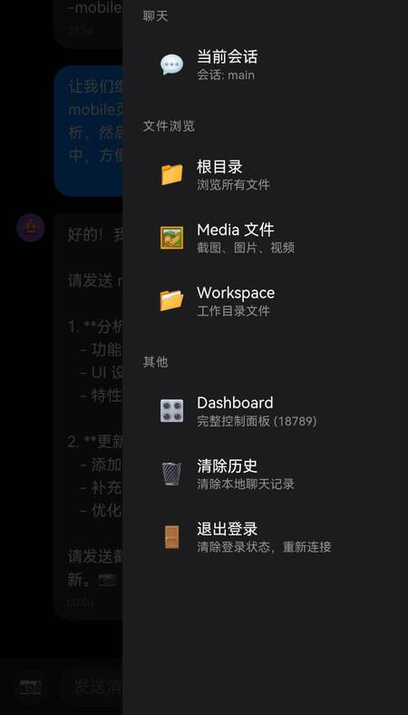
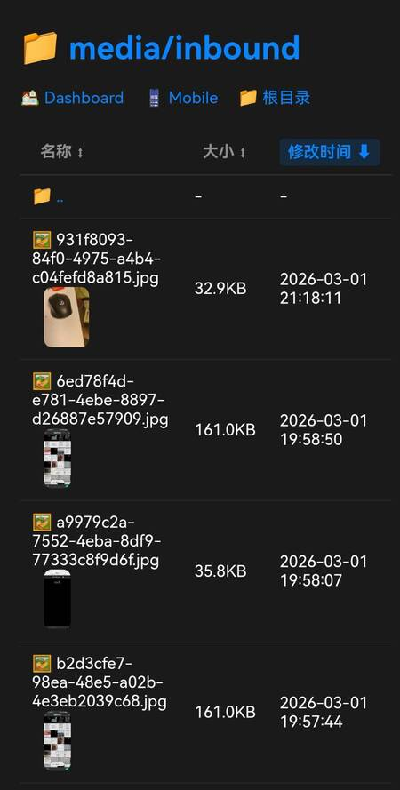
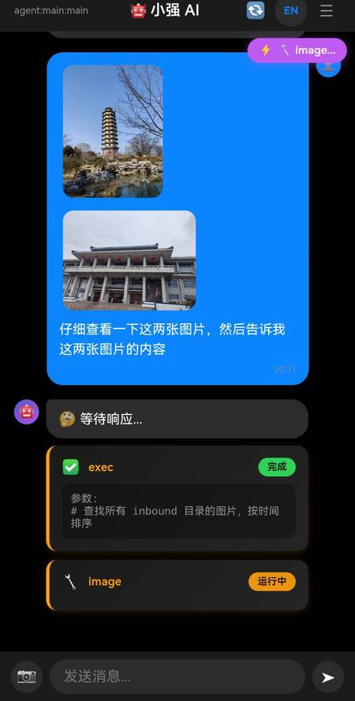
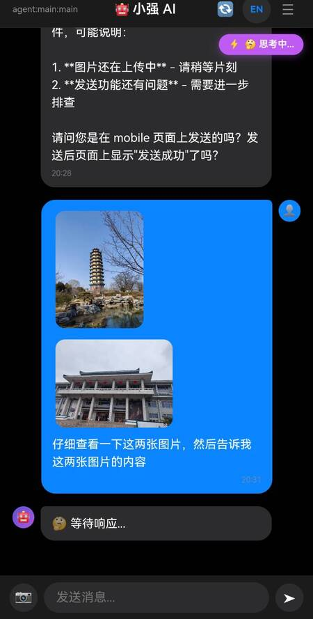

**中文文档** | **[English](README_EN.md)**

# OpenClaw Mobile

一个现代化的 OpenClaw Gateway 移动端 Web 界面，支持实时聊天、工具调用显示、思考过程展示等功能。


## ✨ 功能特性

- 🎨 **现代化 UI** - 深色主题，iOS 风格设计
- 🌐 **多语言支持** - 内置中文/英文，一键切换
- 💬 **实时聊天** - WebSocket 连接，流式输出
- 🧠 **思考过程** - 显示 AI 推理过程
- 🔧 **工具调用** - 显示工具执行状态
- 📱 **移动优化** - 触摸友好，流畅体验
- 🔄 **自动重连** - 网络断开自动重连
- 💾 **登录持久化** - 1小时内免登录
- 📖 **文件浏览** - 内置文件浏览器
- 🔐 **多环境支持** - 支持 Tailscale、云端口转发
- ⚙️ **可自定义** - 助手名称、界面配置

## 📸 界面预览

<table>
  <tr>
    <td align="center"><b>登录页面</b></td>
    <td align="center"><b>侧边菜单</b></td>
  </tr>
  <tr>
    <td></td>
    <td></td>
  </tr>
  <tr>
    <td align="center"><b>文件浏览器</b></td>
    <td align="center"><b>多图片发送</b></td>
  </tr>
  <tr>
    <td></td>
    <td></td>
  </tr>
  <tr>
    <td align="center"><b>思考过程</b></td>
    <td></td>
  </tr>
  <tr>
    <td></td>
    <td></td>
  </tr>
</table>

### 功能说明

| 截图 | 功能 |
|------|------|
| **登录页面** | WebSocket 自动检测、Token 认证、会话配置 |
| **侧边菜单** | 文件浏览、Dashboard、历史管理 |
| **文件浏览器** | 缩略图预览、排序、点击放大 |
| **多图片发送** | 最多 9 张图片、工具调用状态 |
| **思考过程** | AI 思考状态、执行进度 |

## 🚀 快速开始

### 方式一：一键配置（推荐）

```bash
# 克隆项目
git clone https://github.com/yujuntea/openclaw-mobile.git
cd openclaw-mobile

# 运行配置工具
python3 setup.py

# 按照提示完成配置即可
```

配置工具会自动：
- ✅ 检测 Tailscale IP 和主机名
- ✅ 获取 Gateway Token
- ✅ 生成配置文件
- ✅ 配置 systemd 服务
- ✅ 更新 Gateway allowedOrigins

---

## 📖 一键配置使用向导

### 配置流程

```
┌─────────────────────────────────────────────────────────────┐
│                    一键配置工具流程                          │
├─────────────────────────────────────────────────────────────┤
│                                                             │
│  Step 1: 自动检测环境                                      │
│  ├─ Tailscale IP (如 100.x.x.x)                     │
│  ├─ Tailscale 主机名 (如 your-hostname)                        │
│  └─ Gateway Token                                         │
│                                                             │
│  Step 2: AI 助手名称配置                                  │
│  ├─ 助手名称（中文/英文）                                 │
│  └─ 助手描述（中文/英文）                                 │
│                                                             │
│  Step 3: Tailscale 配置（可选）                           │
│  └─ 如不需要，直接回车跳过                                │
│                                                             │
│  Step 3: 访问域名配置                                     │
│  └─ 用于显示访问地址                                      │
│                                                             │
│  Step 4: 云端口转发配置（可选）                            │
│  ├─ HTTP 访问域名                                         │
│  └─ WSS WebSocket 地址                                    │
│                                                             │
│  Step 5: Gateway Token                                    │
│  └─ 自动检测，如不正确可修改                              │
│                                                             │
│  Step 6: Dashboard 目录                                   │
│  └─ 自动检测，默认值即可                                   │
│                                                             │
└─────────────────────────────────────────────────────────────┘
```

### 3 种访问方式组合

| 方式 | 场景 | 配置说明 |
|------|------|----------|
| **方式1** | 仅 Tailscale | 输入 Tailscale IP 和主机名，云转发直接回车跳过 |
| **方式2** | 仅云转发 | Tailscale 直接回车跳过，输入云转发域名和WSS地址 |
| **方式3** | 自定义域名 | Tailscale 和云转发都跳过，输入自定义域名 |
| **组合** | 全部开启 | 输入所有信息，同时支持 Tailscale + 云转发 + 自定义域名 |

### 配置决策表

```
┌──────────────────────────────────────────────────────────────┐
│                    BIND_HOST 决策逻辑                        │
├──────────────────────────────────────────────────────────────┤
│                                                              │
│  有 Tailscale IP？                                          │
│       │                                                     │
│       ├── 是 → BIND_HOST = Tailscale IP                    │
│       │         (仅 Tailscale 网络可访问，更安全)            │
│       │                                                     │
│       └── 否 → BIND_HOST = 0.0.0.0                         │
│                 (所有网络可访问，需防火墙)                   │
│                                                              │
└──────────────────────────────────────────────────────────────┘
```

### 使用示例

**示例1: 仅使用 Tailscale 访问**
```
📋 Tailscale 配置
  检测到 Tailscale IP: 100.x.x.x
  Tailscale IP [100.x.x.x]: (直接回车使用检测值)
  Tailscale 主机名 [your-hostname]: (直接回车使用检测值)

📋 访问域名配置
  访问域名（用于显示） [your-hostname.tailXXXX.ts.net]: (直接回车使用默认值)

📋 云端口转发配置（可选）
  云转发 HTTP 访问域名：(直接回车跳过)
  云转发 WSS 地址: (直接回车跳过)

📋 Gateway 配置
  Gateway Token [自动检测到]: (直接回车使用)
```

**示例2: 仅使用云端口转发**
```
📋 Tailscale 配置
  Tailscale IP [直接回车跳过]: (直接回车跳过)
  Tailscale 主机名 [直接回车跳过]: (直接回车跳过)

📋 访问域名配置
  访问域名（用于显示） [直接回车跳过]: (直接回车跳过)

📋 云端口转发配置
  云转发 HTTP 访问域名: demo.orcaterm.cloud.tencent.com
  云转发 WSS 地址: wss://wss-demo.orcaterm.cloud.tencent.com/
```

**示例 3: 同时使用 Tailscale + 云转发**
```
📋 Tailscale 配置
  检测到 Tailscale IP: 100.x.x.x
  检测到主机名：your-hostname
  
  Tailscale IP [100.x.x.x]: (直接回车使用检测值)
  Tailscale 主机名 [your-hostname]: (直接回车使用检测值)

📋 访问域名配置
  访问域名（用于显示） [your-hostname.tailXXXX.ts.net]: (直接回车使用默认值)

📋 云转发配置
  云转发 HTTP 访问域名：demo.orcaterm.cloud.tencent.com
  云转发 WSS 地址：wss://wss-demo.orcaterm.cloud.tencent.com/

📋 Gateway 配置
  Gateway Token [自动检测到]: (直接回车使用)
```

### 访问地址自动添加

配置工具会自动将以下地址添加到 Gateway 的 `allowedOrigins`：

| 访问方式 | 地址示例 |
|----------|------|
| 本地 | http://localhost:8080 |
| Tailscale IP | http://100.x.x.x:8080 |
| Tailscale 域名 | http://your-hostname.tailXXXX.ts.net:8080 |
| 云转发域名 | http://demo.orcaterm.cloud.tencent.com |

### 配置文件说明

| 文件 | 说明 | 位置 |
|------|------|------|
| `config.js` | 前端配置 | 项目目录上级 |
| `server_config.py` | 后端配置 | 项目目录上级 |
| `openclaw-web.service` | Systemd 服务 | ~/.config/systemd/user/ |

### 常见问题

**Q: 配置会备份吗？**
> A: 是的！运行 setup.py 会自动备份现有配置文件到：
> - 备份位置：`项目目录/../config-backup/`（即 workspace/config-backup/）
> - 文件：`config.js.日期时间`、`server_config.py.日期时间`、`openclaw.json.日期时间`

**Q: 配置后需要重启 Gateway 吗？**
> A: 是的，配置工具会提示你运行：
> ```bash
> systemctl --user restart openclaw-gateway
> ```

**Q: 想修改配置怎么办？**
> A: 重新运行 `python3 setup.py` 即可重新配置

**Q: BIND_HOST 绑定 Tailscale IP 有什么好处？**
> A: 更安全！只有 Tailscale 网络内的设备才能访问服务

---

### 方式二：手动配置

#### 1. 配置项目

```bash
# 克隆项目
git clone https://github.com/yujuntea/openclaw-mobile.git
cd openclaw-mobile

# 创建前端配置文件
cp config.example.js ../config.js

# 创建后端配置文件
cp server_config.example.py ../server_config.py

# 编辑前端配置
vim ../config.js

# 编辑后端配置
vim ../server_config.py
```

#### 2. 前端配置 (config.js)

```javascript
const OPENCLAW_CONFIG = {
  // 应用自定义
  app: {
    appName: '小强 AI',           // 中文名称
    appNameEn: 'XiaoQiang AI',   // 英文名称
    appDesc: 'AI 家庭助手',
    appDescEn: 'AI Family Assistant',
  },
  
  gateway: {
    // 你的 Gateway WebSocket 地址
    defaultWsUrl: 'ws://your-gateway:18789/',
    
    // 你的 Gateway Token
    // 获取方法: cat ~/.openclaw/openclaw.json | jq -r '.gateway.auth.token'
    defaultToken: 'YOUR_GATEWAY_TOKEN_HERE',
  },
  
  // 如果使用云端口转发，配置域名映射
  cloudForward: {
    mapping: {
      'your-http-domain.example.com': 'your-wss-domain.example.com',
    }
  }
};
```

### 3. 后端配置 (server_config.py)

```python
# 监听地址
BIND_HOST = '0.0.0.0'  # 或内网 IP

# 域名（用于显示访问地址）
TAILSCALE_DOMAIN = 'your-gateway-host.example.com'

# Gateway HTTP 地址
GATEWAY_HTTP = 'http://127.0.0.1:18789'

# Dashboard 目录
DASHBOARD_DIR = '/path/to/openclaw/dist/control-ui'
```

### 4. 配置 Gateway

### 3. 启动服务

```bash
# 启动服务
python3 server.py
```

### 4. 配置 Gateway

在 `openclaw.json` 中添加访问域名：

```json
{
  "gateway": {
    "controlUi": {
      "allowedOrigins": [
        "http://localhost:8080",
        "http://your-domain:8080"
      ]
    }
  }
}
```

### 5. 启动服务

#### 前台启动（调试用）

```bash
# 创建符号链接（推荐）
ln -sf $(pwd)/server.py ../server.py
ln -sf $(pwd)/mobile.html ../mobile.html

# 前台启动
cd ..
python3 server.py
```

#### 后台启动（生产环境）

**方式 1：nohup**

```bash
cd /path/to/workspace
nohup python3 server.py > server.log 2>&1 &

# 查看日志
tail -f server.log

# 停止服务
pkill -f "python3 server.py"
```

**方式 2：Systemd 服务（推荐）**

**步骤 1：创建服务文件**

```bash
# 创建目录
mkdir -p ~/.config/systemd/user

# 创建服务文件
cat > ~/.config/systemd/user/openclaw-web.service << 'EOF'
[Unit]
Description=OpenClaw Web Server (Dashboard + Mobile + Media)
After=network.target

[Service]
Type=simple
WorkingDirectory=/path/to/workspace
ExecStart=/usr/bin/python3 /path/to/workspace/server.py
Restart=on-failure
RestartSec=5

[Install]
WantedBy=default.target
EOF

# 注意：修改 WorkingDirectory 和 ExecStart 为你的实际路径
```

**步骤 2：启动服务**

```bash
# 重载配置
systemctl --user daemon-reload

# 启动服务
systemctl --user start openclaw-web

# 开机自启
systemctl --user enable openclaw-web
```

**步骤 3：管理服务**

```bash
# 查看状态
systemctl --user status openclaw-web

# 查看日志
journalctl --user -u openclaw-web -f

# 停止服务
systemctl --user stop openclaw-web

# 重启服务
systemctl --user restart openclaw-web
```

### 6. 访问界面

打开浏览器访问：
- 本地: `http://localhost:8080/`
- 内网: `http://<your-ip>:8080/`
- 完整: `http://your-domain:8080/`

> 💡 访问根路径 `/` 会自动跳转到 mobile 页面

## ⚙️ 配置

### 配置文件说明

| 文件 | 用途 | 位置 |
|------|------|------|
| `config.js` | 前端配置 | 项目目录上级 |
| `server_config.py` | 后端配置 | 项目目录上级 |
| `config.example.js` | 前端配置模板 | 项目目录 |
| `server_config.example.py` | 后端配置模板 | 项目目录 |
| `i18n.js` | 国际化配置 | 项目目录 |

**注意**：`config.js` 和 `server_config.py` 包含敏感信息，不会进入 Git。

## 🌐 多语言支持

OpenClaw Mobile 支持多语言，可轻松切换。

### 支持的语言

| 语言 | 代码 | 状态 |
|------|------|------|
| 中文 | `zh-CN` | ✅ 内置 |
| English | `en-US` | ✅ 内置 |

### 切换语言

- 点击顶部的语言按钮（显示 "EN" 或 "中"）
- 语言偏好保存到 localStorage
- 界面即时更新，无需刷新

### 自定义助手名称

可以在 `config.js` 中自定义不同语言的助手名称：

```javascript
const OPENCLAW_CONFIG = {
  app: {
    appName: '我的助手',         // 中文名称
    appNameEn: 'My Assistant', // 英文名称
  }
};
```

### 添加新语言

要添加新语言，编辑 `i18n.js`：

```javascript
languages: {
  'zh-CN': { ... },
  'en-US': { ... },
  'ja-JP': {  // 日语
    appName: 'AIアシスタント',
    appDesc: 'AIアシスタント',
    // ... 添加其他翻译
  }
}
```

### WebSocket 地址自动检测

mobile.html 通过 `getWebSocketUrl()` 函数自动检测访问环境并选择正确的 WebSocket 地址：

```javascript
function getWebSocketUrl() {
  const currentHost = window.location.hostname;
  
  // 1. 云端口转发检测（腾讯云等）
  if (cloudForward.enabled && currentHost.includes(cloudForward.domainPattern)) {
    // 优先使用配置的 wsUrl
    if (cloudForward.wsUrl) return cloudForward.wsUrl;
    // 没有配置则使用 wss://当前域名/
    return `wss://${currentHost}/`;
  }
  
  // 2. Tailscale 检测
  if (tailscale.enabled && currentHost.includes(tailscale.domainPattern)) {
    return `ws://${currentHost}:18789/`;
  }
  
  // 3. 默认
  return gateway.defaultWsUrl;
}
```

#### 配置示例

```javascript
// config.js
const OPENCLAW_CONFIG = {
  gateway: {
    defaultWsUrl: 'ws://your-hostname.tailXXXX.ts.net:18789/',
    // ...
  },
  cloudForward: {
    enabled: true,
    domainPattern: '.orcaterm.cloud.tencent.com',
    wsUrl: 'wss://forward-wss-xxx.orcaterm.cloud.tencent.com/'
  },
  tailscale: {
    enabled: true,
    domainPattern: '.tailXXXX.ts.net',
    wsPort: 18789
  }
};
```

#### 判断逻辑流程

```
访问域名检测
    │
    ├─ 包含云端口转发域名（如 .orcaterm.cloud.tencent.com）？
    │       │
    │       ├─ cloudForward.wsUrl 已配置？
    │       │       └─ YES → 使用 cloudForward.wsUrl
    │       │                例：wss://forward-wss-xxx.orcaterm.cloud.tencent.com/
    │       │
    │       └─ NO → 使用 wss://当前域名/
    │
    ├─ 包含 Tailscale 域名（如 .tailXXXX.ts.net）？
    │       └─ YES → 使用 ws://当前域名:18789/
    │
    └─ 其他环境
            └─ 使用 gateway.defaultWsUrl
```

#### 不同环境的配置方式

| 访问方式 | HTTP 地址 | WebSocket 地址 | 配置项 |
|----------|-----------|----------------|--------|
| Tailscale | `http://host.tailXXX.ts.net:8080` | `ws://host.tailXXX.ts.net:18789/` | `tailscale.wsPort` |
| 腾讯云转发 | `https://forward-xxx.orcaterm...` | `wss://forward-wss-...` | `cloudForward.wsUrl` |
| 本地开发 | `http://localhost:8080` | `ws://localhost:18789/` | `gateway.defaultWsUrl` |

### Tailscale 配置

如果使用 Tailscale 进行内网穿透，需要配置以下内容：

#### 1. 前端配置 (config.js)

```javascript
tailscale: {
  enabled: true,
  domainPattern: '.tailXXXX.ts.net',  // 你的 Tailscale 域名后缀
  wsPort: 18789  // Gateway WebSocket 端口
}
```

#### 2. 后端配置 (server_config.py)

```python
# 绑定到 Tailscale IP（推荐）
BIND_HOST = '100.x.x.x'  # 你的 Tailscale IP

# 或者绑定到所有接口（需要防火墙保护）
# BIND_HOST = '0.0.0.0'

TAILSCALE_DOMAIN = 'your-hostname.tailXXXX.ts.net'
```

#### 3. Gateway 配置 (openclaw.json)

```json
{
  "gateway": {
    "controlUi": {
      "allowedOrigins": [
        "http://your-hostname.tailXXXX.ts.net:8080",
        "http://your-hostname.tailXXXX.ts.net"
      ]
    }
  }
}
```

#### 4. 获取 Tailscale 信息

```bash
# 查看 Tailscale IP
tailscale ip

# 查看 Tailscale 域名
tailscale status
```

### Gateway allowedOrigins

在 `openclaw.json` 中添加所有访问域名：

```json
{
  "gateway": {
    "controlUi": {
      "allowedOrigins": [
        "http://localhost:8080",
        "http://localhost:18789",
        "http://your-hostname.tailXXXX.ts.net:8080",
        "http://your-hostname.tailXXXX.ts.net",
        "https://your-https-domain.example.com"
      ]
    }
  }
}
```

## 📖 文档

- [部署指南](docs/DEPLOYMENT.md)
- [配置说明](docs/CONFIGURATION.md)
- [安全注意事项](docs/SECURITY.md)
- [技术架构](docs/ARCHITECTURE.md) - 技术实现详解

## 🏗️ 技术架构

### 整体架构

```
┌──────────────┐     WebSocket      ┌──────────────────┐
│  mobile.html │ ◄─────────────────► │  OpenClaw Gateway │
│  (前端)      │                     │  (WebSocket 服务) │
└──────┬───────┘                     └──────────────────┘
       │
       │ HTTP (图片上传)
       ▼
┌──────────────┐     HTTP 代理      ┌──────────────────┐
│  server.py   │ ──────────────────► │  OpenClaw Gateway │
│  (后端)      │                     │  (HTTP API)       │
└──────────────┘                     └──────────────────┘
```

### 核心功能

| 功能 | 实现方式 | 说明 |
|------|----------|------|
| 实时通信 | WebSocket | 与 Gateway 双向通信 |
| 流式输出 | Event 流 | 打字机效果，实时显示 |
| 思考过程 | 自定义渲染 | 紫色背景 + 左边框 |
| 工具调用 | 状态渲染 | 橙色(运行)、绿色(完成)、红色(失败) |
| 图片上传 | HTTP POST → Gateway | 支持压缩、base64 |
| 自动重连 | setTimeout(3s) | 断线自动重连 |
| 登录持久化 | LocalStorage | 1小时免登录 |
| 域名检测 | JS 自动判断 | 支持 Tailscale、云端口转发 |

### 技术栈

| 层级 | 技术 |
|------|------|
| 前端 | 原生 JavaScript + WebSocket API + CSS3 |
| 后端 | Python http.server + urllib |
| 通信 | WebSocket (实时) + HTTP (文件) |
| 存储 | LocalStorage (登录状态) |

### 核心模块

| 模块 | 职责 |
|------|------|
| `GwClient` | WebSocket 客户端，管理连接、认证、消息 |
| `handleMessage` | 消息处理器，处理 res/event 消息 |
| `renderMessage` | 消息渲染，支持文本、思考、工具调用 |
| `renderThinking` | 思考过程渲染，流式显示 |
| `renderToolCall` | 工具调用渲染，状态动画 |
| `uploadImage` | 图片上传，压缩 + base64 编码 |

### 与 Gateway 的交互

**WebSocket API**：

| 方法 | 说明 |
|------|------|
| `connect` | 认证连接 |
| `chat.send` | 发送消息 |
| `chat.history` | 获取历史 |
| `chat.abort` | 中止生成 |

**认证流程**：
```
WebSocket 连接 → connect.challenge → 发送 token → hello-ok → 认证成功
```

**消息格式**：
```javascript
{
  type: 'event',
  event: 'chat.message',
  payload: {
    content: [
      { type: 'text', text: '...' },
      { type: 'thinking', thinking: '...' },
      { type: 'tool_call', name: '...', input: {...} }
    ]
  }
}
```

详细架构文档请参阅 [技术架构](docs/ARCHITECTURE.md)。

## 🔒 安全注意事项

⚠️ **务必阅读**：在公开分享或部署前，请确保：

1. **移除敏感信息**
   - Token 令牌
   - 内网 IP 地址
   - 域名信息
   - 端口转发配置

2. **配置 Gateway 安全**
   - 设置 `allowedOrigins` 白名单
   - 使用 HTTPS 加密
   - 定期更换 Token

3. **网络安全**
   - 不要暴露到公网
   - 使用内网或 VPN 访问
   - 配置防火墙规则

## 🤝 贡献

欢迎提交 Issue 和 Pull Request！

## 📄 License

GNU General Public License v3.0

## 🙏 致谢

- [OpenClaw](https://github.com/openclaw/openclaw) - AI Agent Framework
- 所有贡献者
